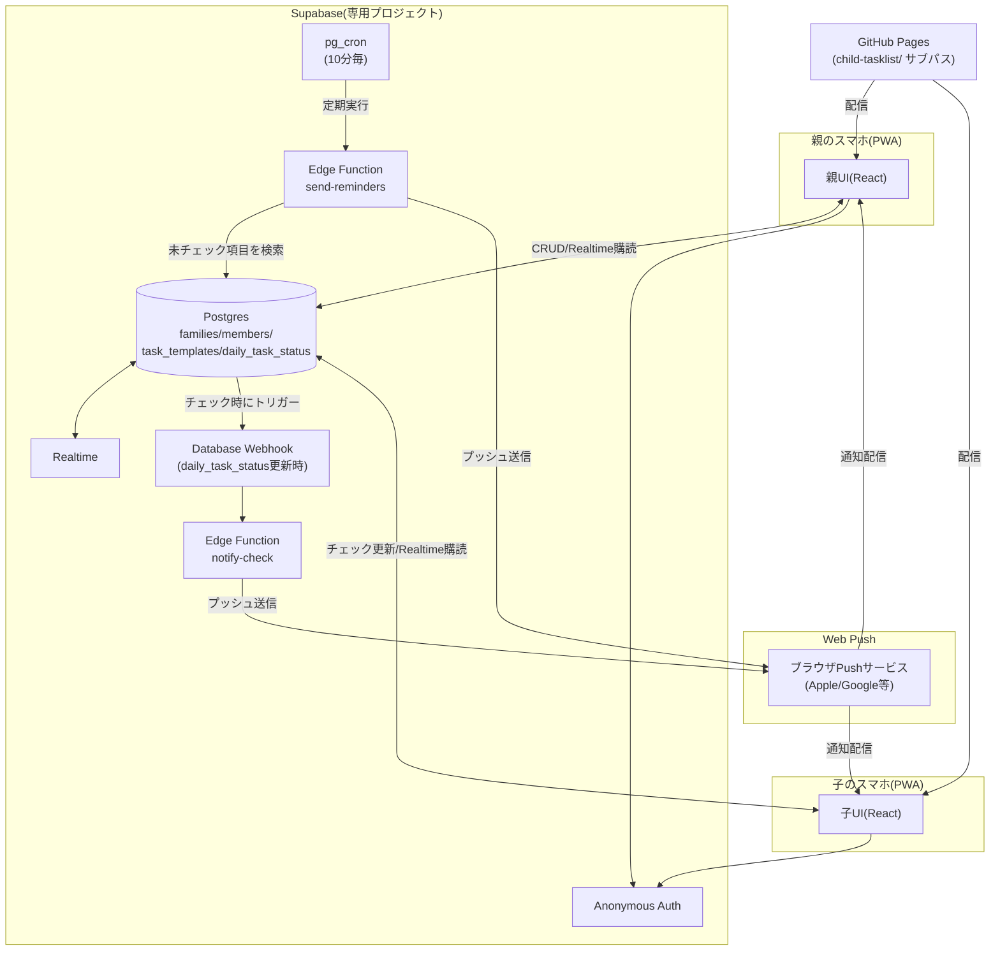

# システム構成書 — 子ども遠征タスクリストアプリ

version: 0.1(ドラフト)。要件定義書(`requirements.md`)を前提とする。

## 1. 方針

- 家計簿アプリ(`web/`)は「バックエンドなし・単一端末」だったが、本アプリは**親子2台以上の端末間でのデータ共有とプッシュ通知配信**が必須のため、BaaS(Supabase)を新たに導入する。
- Supabaseは本アプリ専用の**新規プロジェクト**を作成する(家計簿用など他プロジェクトとはDB・容量を分離する。ユーザー確認済み)。
- クレジットカード登録が前提となるFirebase Blazeプラン(Cloud Functions/Cloud Schedulerに必須)は避け、無料プランのままpg_cron・Database Webhooks・Edge Functionsが使えるSupabaseを採用する。

## 2. 全体構成図

**ポイント**: フロントエンドは家計簿アプリと同じVite+React+TypeScriptのPWA構成を踏襲しつつ、データ永続化とプッシュ通知配信のみSupabaseに委譲する。銀行/カードサイトのような外部連携は無いため、家計簿アプリより構成はシンプル。

## 3. コンポーネント一覧

| コンポーネント | 役割 | 技術 |
|---|---|---|
| 親UI / 子UI | 同一コードベース。ログイン後のロール(parent/child)に応じて表示を分岐 | React + TypeScript |
| Postgres | families/members/task_templates/daily_task_status を保存 | Supabase Postgres |
| Realtime | 親の「今日の進捗」画面をリアルタイム更新 | Supabase Realtime(Postgres Changes) |
| Anonymous Auth | 端末ごとの匿名認証。招待コードで家族に紐付け | Supabase Auth |
| send-reminders | 未チェック項目を検出し、子端末へリマインドPushを送信。pg_cronから10分毎に起動 | Supabase Edge Function(Deno) + web-push |
| notify-check | 子がチェックした瞬間、親端末へ完了Pushを送信。Database Webhookから起動 | Supabase Edge Function(Deno) + web-push |
| Service Worker | Web Pushの受信・通知表示、PWAのオフラインキャッシュ | 自前のsw.ts(vite-plugin-pwa `injectManifest`戦略) |
| ホスティング | ビルド済み静的ファイルの配信 | GitHub Pages(`web/`と同一リポジトリ、別サブパス) |

## 4. なぜSupabaseか(比較)

| 観点 | Supabase(採用) | Firebase |
|---|---|---|
| 定期実行(リマインド用) | pg_cron、無料プランで利用可 | Cloud Scheduler。Cloud Functions自体が要Blazeプラン(要クレカ登録) |
| DB更新をトリガーに即時実行(親への通知) | Database Webhooks、無料プランで利用可 | Firestore Trigger、同じくBlazeプラン必須 |
| プッシュ通知 | Web Push標準(VAPID)を自前実装。ベンダーロックインなし | FCM(内部的にはWeb Push相当。iOSはSafari経由で結局標準Web Pushに帰着) |
| 初期費用 | クレカ登録不要で開始できる | Blazeプラン移行にクレカ登録が必要(実利用額は$0見込みでも心理的障壁) |
| 開発体験 | SQL・RLSに慣れが必要 | Firestoreはスキーマレスで始めやすい |

家計簿アプリでMac不要・費用ゼロを優先した経緯(architecture.md参照)と同じ考え方で、クレカ登録が前提となるFirebaseの定期実行機能は避け、Supabaseを選定した。

## 5. データ量の見積もり(容量確認)

- `daily_task_status` が最も増えるテーブル。子1人・項目10個・毎日運用で1日最大10行
- 5年間毎日使っても 10行 × 365日 × 5年 ≒ 18,250行。1行あたり数百バイトとして数MB程度
- `families` / `members` / `task_templates` はほぼ増えない静的データ
- 無料プランのDB上限500MBに対して、本アプリ単体では実質無視できる容量。かつ他プロジェクトとは別プロジェクトのため容量を共有しない

## 6. セキュリティアーキテクチャ概要

- 家族ごとにRow Level Security(RLS)でデータを分離し、他家族の`families`/`members`/`task_templates`/`daily_task_status`にはアクセスできない(design.md 3章のRLSポリシー参照)
- 端末の認証はSupabase Anonymous Authを使用し、氏名等の個人情報を必須入力にしない
- 家族への参加は「招待コード」の入力のみで行う(親が家族作成時に発行される8桁程度のコードを子端末に手入力させる想定)。コードの強度はv1では簡易的なものとし、外部公開・SNS共有はしないことを前提とする
- Push通知の宛先(`push_subscription`)は各メンバー本人のみが更新でき、Edge Function(service role key)からのみ読み取り可能とする
