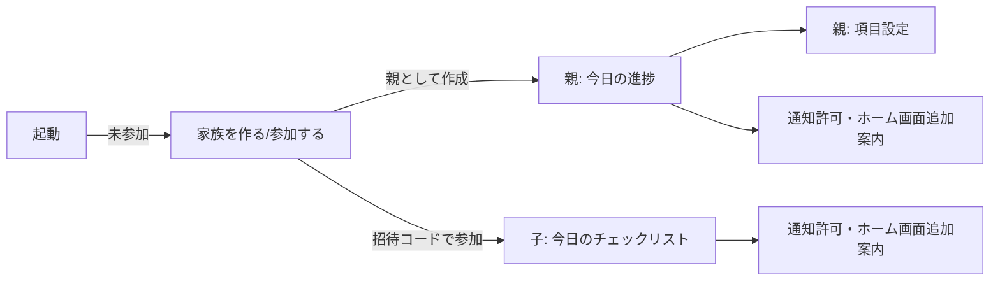

# 詳細設計書 — 子ども遠征タスクリストアプリ

version: 0.1(ドラフト)。要件定義書(`requirements.md`)・システム構成書(`architecture.md`)を前提とする。

## 1. 画面一覧・遷移



| 画面 | 概要 | 実装 |
|---|---|---|
| 家族を作る/参加する | 初回起動時。「親として家族を作る」か「招待コードで子として参加する」を選ぶ | `JoinOrCreateView.tsx` |
| 親: 今日の進捗 | 当日のチェックリストと各項目の完了状況をリアルタイム表示。招待コード再表示も可能 | `ParentTodayView.tsx` |
| 親: 項目設定 | チェックリスト項目(タイトル・時間帯・目安時刻)の追加・編集・削除・並び替え | `ParentSetupView.tsx` |
| 子: 今日のチェックリスト | 朝・昼・晩ごとにグルーピングした当日の項目。タップでチェックのON/OFF | `ChildChecklistView.tsx` |
| 通知許可・ホーム画面追加案内 | 初回に「ホーム画面に追加」の手順と、通知許可ボタンを表示 | `NotificationSetupView.tsx` |

## 2. データモデル(Postgres / TypeScript)

```sql
-- 家族(招待コードで親子を紐付ける単位)
create table families (
  id uuid primary key default gen_random_uuid(),
  name text not null default '我が家',
  invite_code text not null unique,
  created_at timestamptz not null default now()
);

-- 家族に属する端末(匿名認証のユーザーと1:1)
create table members (
  id uuid primary key default gen_random_uuid(),
  family_id uuid not null references families(id) on delete cascade,
  auth_user_id uuid not null unique references auth.users(id) on delete cascade,
  role text not null check (role in ('parent', 'child')),
  display_name text not null default '',
  push_subscription jsonb,
  created_at timestamptz not null default now()
);

-- チェックリスト項目のテンプレート(親が設定。毎日同じ内容を使い回す)
create table task_templates (
  id uuid primary key default gen_random_uuid(),
  family_id uuid not null references families(id) on delete cascade,
  title text not null,
  time_slot text not null check (time_slot in ('morning', 'noon', 'evening')),
  target_time time not null,
  display_order integer not null default 0,
  active boolean not null default true,
  created_at timestamptz not null default now()
);

-- 日毎のチェック状態・リマインド送信状況(テンプレート×日付で一意)
create table daily_task_status (
  id uuid primary key default gen_random_uuid(),
  template_id uuid not null references task_templates(id) on delete cascade,
  date date not null,
  checked_at timestamptz,
  checked_by uuid references members(id),
  last_reminded_at timestamptz,
  reminder_count integer not null default 0,
  unique (template_id, date)
);
```

```typescript
export type TimeSlot = "morning" | "noon" | "evening";
export type MemberRole = "parent" | "child";

export interface Family {
  id: string;
  name: string;
  inviteCode: string;
  createdAt: string;
}

export interface Member {
  id: string;
  familyId: string;
  authUserId: string;
  role: MemberRole;
  displayName: string;
  pushSubscription: PushSubscriptionJSON | null;
  createdAt: string;
}

export interface TaskTemplate {
  id: string;
  familyId: string;
  title: string;
  timeSlot: TimeSlot;
  targetTime: string; // "HH:mm:ss"
  displayOrder: number;
  active: boolean;
  createdAt: string;
}

export interface DailyTaskStatus {
  id: string;
  templateId: string;
  date: string; // "YYYY-MM-DD"
  checkedAt: string | null;
  checkedBy: string | null;
  lastRemindedAt: string | null;
  reminderCount: number;
}
```

**日次リセットの実現方法**: `daily_task_status`は「チェックされた時」または「リマインドが送信された時」に初めて`(template_id, date)`の行が作られる(upsert)。行が存在しない当日分は「未チェック」とみなす。日付が変わればテンプレートは同じでも新しい`date`の行が対象になるため、明示的なリセット処理は不要。

## 3. Row Level Security(RLS)方針

全テーブルでRLSを有効化する。家族外のデータには一切アクセスできないようにする。

```sql
-- 自分の家族IDを返すヘルパー(RLSの再帰を避けるためsecurity definer)
create function current_family_id() returns uuid
language sql security definer stable as $$
  select family_id from members where auth_user_id = auth.uid() limit 1;
$$;

create function is_parent() returns boolean
language sql security definer stable as $$
  select exists (
    select 1 from members where auth_user_id = auth.uid() and role = 'parent'
  );
$$;
```

| テーブル | SELECT | INSERT | UPDATE |
|---|---|---|---|
| `families` | 認証済みなら誰でも(招待コード入力時に家族名を確認するため。招待コードは推測困難な文字列とする) | 認証済みなら誰でも(家族作成時) | 不可 |
| `members` | `auth_user_id = auth.uid()` または `family_id = current_family_id()` | `auth_user_id = auth.uid()`(自分自身の初回登録のみ) | `auth_user_id = auth.uid()`(push_subscription等の自己更新のみ) |
| `task_templates` | `family_id = current_family_id()` | `family_id = current_family_id() and is_parent()` | `family_id = current_family_id() and is_parent()` |
| `daily_task_status` | 紐づく`task_templates.family_id = current_family_id()` | 同上(親・子どちらもチェック可) | 同上 |

Edge Function(`send-reminders`/`notify-check`)はservice role keyで実行するためRLSをバイパスし、全家族分を横断的に処理する。

## 4. 通知フロー詳細

### 4.1 リマインド(子への繰り返し通知)

`send-reminders`はpg_cronから10分毎に起動される(post-setup.sql参照)。

1. 現在時刻(JST)から今日の日付`today`を求める
2. `active = true`な`task_templates`のうち、`target_time <= 現在時刻` のものを全家族分取得
3. 各テンプレートについて`daily_task_status`の`(template_id, today)`行を確認
   - `checked_at`が設定済み → スキップ(完了済み)
   - `last_reminded_at`が`null`、または現在時刻との差が30分以上 → リマインド対象
   - 時間帯ごとに固定の締め時刻(朝=12:00、昼=18:00、晩=23:00)を過ぎていたら対象外(深夜の通知を防止)
4. リマインド対象のテンプレートについて、そのfamilyの`role = 'child'`な`members`の`push_subscription`にWeb Pushを送信
5. `daily_task_status`を`upsert`し、`last_reminded_at = now()`、`reminder_count = reminder_count + 1`を記録

### 4.2 完了通知(親への即時通知)

`daily_task_status`への`checked_at`が`null`から非`null`に変わったタイミングでDatabase Webhookが`notify-check`を起動する(post-setup.sql参照)。

1. 対象行の`template_id`から`task_templates`を辿り`family_id`を特定
2. その家族の`role = 'parent'`な`members`全員の`push_subscription`にWeb Pushを送信(本文例:「◯◯が『歯磨き』を完了しました」)

### 4.3 Push購読の登録

- 各端末はService Worker登録後、`PushManager.subscribe()`でブラウザのPushサービスへ購読し、得られた`PushSubscription`を自分の`members.push_subscription`へ保存する
- VAPID公開鍵はフロントエンドの環境変数(`VITE_VAPID_PUBLIC_KEY`)、秘密鍵はEdge Function側のシークレット(`VAPID_PRIVATE_KEY`)として管理する(post-setup.sql / README参照)

## 5. Service Worker(Push受信)

`vite-plugin-pwa`の`injectManifest`戦略を使い、自前の`src/sw.ts`でPWAの通常キャッシュに加えて`push`イベントを処理する。

```typescript
self.addEventListener("push", (event) => {
  const data = event.data?.json() ?? {};
  event.waitUntil(
    self.registration.showNotification(data.title ?? "タスクリスト", {
      body: data.body ?? "",
      icon: "icons/icon-192.png",
      badge: "icons/icon-192.png",
    })
  );
});

self.addEventListener("notificationclick", (event) => {
  event.notification.close();
  event.waitUntil(self.clients.openWindow("./"));
});
```

## 6. エラーハンドリング方針

| ケース | 対応 |
|---|---|
| 招待コードが存在しない | 「コードが見つかりません」を表示し、再入力を促す |
| Push購読が未許可・失敗 | チェックリスト自体は通知なしで利用可能とし、画面上部に「通知が未設定です」の案内を出す |
| `push_subscription`が失効(410 Gone等) | Edge Function側でエラーを捕捉し、該当メンバーの`push_subscription`を`null`にリセットする(再購読を促す) |
| Supabase接続エラー | 画面にエラーメッセージと再試行ボタンを表示する |

## 7. 将来拡張ポイント(v1スコープ外)

- 子ども複数人のUI(現状データモデルは複数`members(role='child')`を許容しているが、子UIは家族内の子ども1人を前提にした表示になっている)
- 遠征期間(開始日・終了日)の設定
- 項目ごとのリマインド間隔のカスタマイズ(現状は固定30分)
