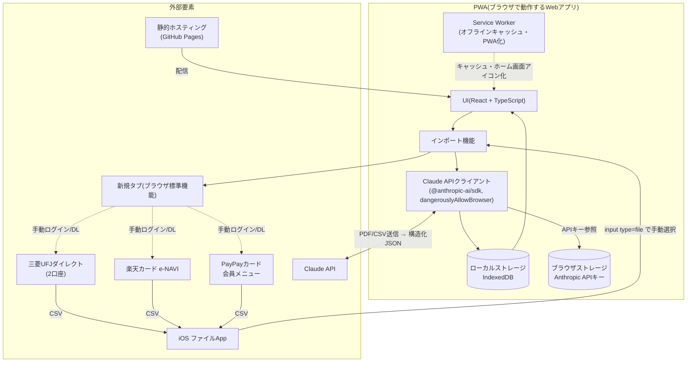
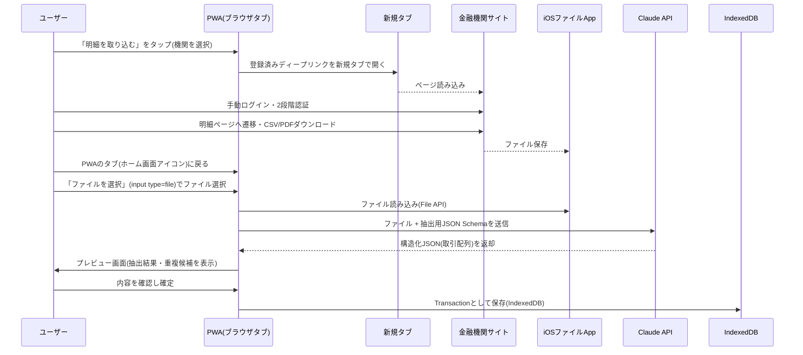

# システム構成書 — 個人用家計簿アプリ

version: 0.2(ドラフト)。**Mac非保有のため、Xcode/Swiftネイティブアプリからブラウザで動くPWA(Progressive Web App)方式に転換**(2026年の方針転換を反映)。

## 1. 方針転換の経緯

- 当初はiOSネイティブ(Swift/SwiftUI)アプリとして設計していたが、開発者がMacを保有していない(iPhoneのみ)ことが判明した
- iOSネイティブアプリの実機インストールには、Xcodeでのビルド(macOS必須)に加え、TestFlight配信のためのApple Developer Program登録(年間$99)が必要になる
- **費用ゼロ・Mac不要**を優先し、Webアプリ(PWA)としてSafariの「ホーム画面に追加」機能でアプリのように使う方式に転換した
- これに伴い、機能要件(要件定義書)は変更なしだが、実現方式(本書・design.md)を全面的に書き換えている

## 2. 全体構成図

**ポイント**: サーバー(バックエンド)は持たず、ブラウザからClaude APIへ直接通信する点はネイティブ版の設計から変わらない。「手動ログイン→ダウンロード→手動選択→AI解析」という半自動フローの考え方もそのまま踏襲し、`SFSafariViewController`が「新規タブを開く」ブラウザ標準機能に置き換わっただけである。

## 3. コンポーネント一覧

| コンポーネント | 役割 | 技術 |
|---|---|---|
| UI | 取引一覧・インポート・集計・設定画面のUI | React + TypeScript |
| インポート機能 | 取り込み元選択・新規タブ起動・ファイル選択・プレビュー確認 | `window.open()` + `<input type="file">` |
| Claude APIクライアント | PDF/CSVをClaude APIへ送信し、構造化JSONを受信 | `@anthropic-ai/sdk`(`dangerouslyAllowBrowser: true`) |
| ローカルストレージ | 取引データ・取り込み元設定・カテゴリ等の永続化 | IndexedDB(`idb`ライブラリ経由) |
| APIキー保存 | Anthropic APIキーの保存 | ブラウザストレージ(IndexedDB。Keychainほどの保護は無い点に注意、5章参照) |
| Service Worker / マニフェスト | ホーム画面へのアイコン追加、オフライン時の静的アセットキャッシュ | `vite-plugin-pwa`(Workbox) |
| ホスティング | ビルド済み静的ファイルの配信 | GitHub Pages(無料) |

## 4. 技術スタック

| レイヤー | 選定技術 | 理由 |
|---|---|---|
| プラットフォーム | Webブラウザ(iOS Safari想定) | Mac不要・費用ゼロで自分のiPhoneにインストール可能な唯一の現実的な手段 |
| フレームワーク | Vite + React + TypeScript | 定番構成で情報量が多く、この開発環境(Linux)でも`npm run build`で実際にビルド検証ができる |
| PWA化 | `vite-plugin-pwa` | マニフェスト・Service Workerの設定を自動化し、「ホーム画面に追加」を機能させる |
| バックエンド | なし | 個人単一ユーザー利用のため、サーバー運用コストを回避(ネイティブ版から方針継続) |
| 外部API | Claude API(Anthropic) | PDF/CSVの直接解析・構造化JSON出力に対応 |
| APIクライアント | `@anthropic-ai/sdk`(公式JS/TS SDK) | ブラウザからの直接利用を`dangerouslyAllowBrowser`オプションで公式にサポートしている |
| ローカルDB | IndexedDB(`idb`) | ブラウザ標準の永続化機構。ネイティブ版のSwiftData相当 |
| ホスティング | GitHub Pages | 既存のGitHubリポジトリからそのまま無料でデプロイできる |

## 5. データフロー(インポート処理のシーケンス)

## 6. 外部サービス依存

| サービス | 用途 | 依存度・リスク |
|---|---|---|
| 三菱UFJダイレクト / 楽天e-NAVI / PayPayカード会員メニュー | 明細のCSV/PDFダウンロード元 | 各社のサイト構成変更によりディープリンクが失効する可能性あり(手動操作のみのため自動化ツールほどの壊れやすさはない) |
| Claude API(Anthropic) | 明細ファイルの構造化データ抽出 | API仕様変更・料金改定の可能性。ブラウザから直接呼び出すため、通信はTLSで暗号化されるがAPIキーはクライアント側に存在する(5章参照) |
| GitHub Pages | 静的サイトホスティング | 無料。GitHubのサービス障害時はサイトにアクセスできない(オフラインキャッシュがあれば既存データの閲覧は可能な場合がある) |

## 7. セキュリティアーキテクチャ概要

- **認証情報の非保持**: 銀行・カードのログイン情報はアプリ内のどこにも保存しない(常に新規タブでの手動入力のみ、ネイティブ版から変更なし)
- **APIキー管理**: Anthropic APIキーはユーザーが設定画面から入力し、IndexedDBに保存する。**Keychainのようなハードウェア保護は無い**ため、ネイティブ版より保護レベルは下がる。個人が自分の端末でのみアクセスするPWAである(URLを公開・共有しない)ことを前提としたリスク許容とする
- **`dangerouslyAllowBrowser`について**: Anthropic公式SDKがこの名称を付けている理由は、公開Webサービスでクライアント側にAPIキーを埋め込むと、ブラウザの開発者ツールから第三者に読み取られ得るため。本アプリは個人専用・非公開のPWAであり、この用途では許容されるリスクと判断する
- **通信の暗号化**: Claude API・GitHub Pages・各金融機関サイトとの通信はいずれもTLSで暗号化される
- **送信データの最小化**: Claude APIへは明細ファイルの内容(店名・金額・日付)のみを送信し、口座番号等の機微情報は事前にマスキングすることを推奨(運用上の対策、要件定義書5.1参照)
- **ローカルデータの永続性リスク**: iOS Safariには一定期間操作が無いサイトのローカルストレージ(IndexedDB含む)を消去することがあるという既知の制約がある。データ消失に備え、エクスポート/インポート(バックアップ)機能をv1スコープに含める(design.md参照)
