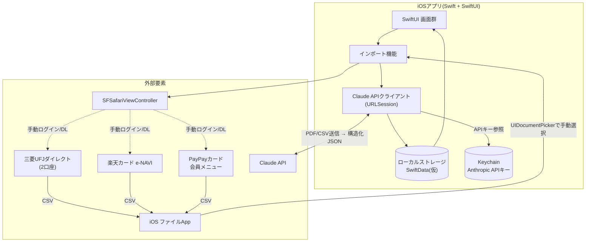
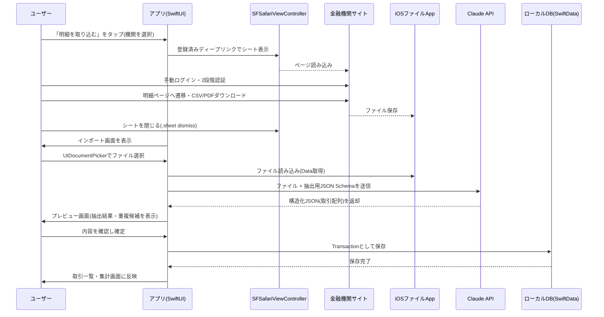

# システム構成書 — 個人用家計簿アプリ

version: 0.1(ドラフト)

## 1. 全体構成図

**ポイント:** アプリはバックエンドサーバーを持たず、iOSアプリからClaude APIへ直接通信する(個人単一ユーザー利用のため)。銀行・カードサイトへのアクセスはすべて`SFSafariViewController`経由の手動操作であり、アプリのコードが自動でその画面を操作することはない。

## 2. コンポーネント一覧

| コンポーネント | 役割 | 技術 |
|---|---|---|
| SwiftUI 画面群 | 取引一覧・インポート・集計・設定画面のUI | SwiftUI |
| インポート機能 | 取り込み元選択・SFSafariViewController起動・ファイル選択・プレビュー確認 | UIKit連携(`UIViewControllerRepresentable`)、`UIDocumentPicker` |
| Claude APIクライアント | PDF/CSVをClaude APIへ送信し、構造化JSONを受信・デコード | `URLSession` + `Codable` |
| ローカルストレージ | 取引データ・取り込み元設定の永続化 | SwiftData(仮採用、要件定義書の未決事項を参照) |
| Keychain | Anthropic APIキーの安全な保存 | Keychain Services(またはラッパーライブラリ) |

## 3. 技術スタック

| レイヤー | 選定技術 | 理由 |
|---|---|---|
| プラットフォーム | iOS単独 | Android対応不要のため、クロスプラットフォームのメリットが無い |
| UI | SwiftUI | ネイティブの標準UIフレームワーク、状態管理がシンプル |
| 言語 | Swift | ネイティブ実装により`WKWebView`/`SFSafariViewController`の制御が最も柔軟 |
| バックエンド | なし | 個人単一ユーザー利用のため、サーバー運用コストを回避 |
| 外部API | Claude API(Anthropic) | PDF/CSVの直接解析・構造化JSON出力に対応 |
| 認証情報保管 | iOS Keychain | 平文保存を避け、端末内で安全に保持 |
| ローカルDB | SwiftData(仮) | Codable構造体との親和性、SwiftUIとの統合が容易 |

## 4. データフロー(インポート処理のシーケンス)

## 5. 外部サービス依存

| サービス | 用途 | 依存度・リスク |
|---|---|---|
| 三菱UFJダイレクト / 楽天e-NAVI / PayPayカード会員メニュー | 明細のCSV/PDFダウンロード元 | 各社のサイト構成変更によりディープリンクが失効する可能性あり(手動操作のみのため自動化ツールほどの壊れやすさはない) |
| Claude API(Anthropic) | 明細ファイルの構造化データ抽出 | API仕様変更・料金改定の可能性。APIキーはKeychainで管理し、通信はTLSで暗号化 |

## 6. セキュリティアーキテクチャ概要

- **認証情報の非保持**: 銀行・カードのログイン情報はアプリ内のどこにも保存しない(常に`SFSafariViewController`上での手動入力のみ)
- **APIキー管理**: Anthropic APIキーはユーザーが設定画面から入力し、Keychainに保存。ソースコードやバイナリへのハードコードは行わない
- **通信の暗号化**: `SFSafariViewController`(Safari本体)およびClaude API通信はいずれもTLSで暗号化される
- **送信データの最小化**: Claude APIへは明細ファイルの内容(店名・金額・日付)のみを送信し、口座番号等の機微情報は事前にマスキングすることを推奨(運用上の対策、要件定義書5.1参照)
