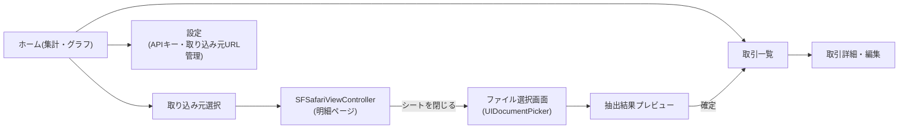

# 詳細設計書 — 個人用家計簿アプリ

version: 0.1(ドラフト)。要件定義書(`requirements.md`)・システム構成書(`architecture.md`)を前提とする。

## 1. 画面一覧・遷移



| 画面 | 概要 |
|---|---|
| ホーム | 月次サマリー・カテゴリ別グラフを表示するトップ画面 |
| 取引一覧 | 登録済み取引のリスト表示、検索・絞り込み |
| 取引詳細・編集 | 個別取引のカテゴリ変更・金額修正・削除 |
| 取り込み元選択 | 三菱UFJ(2口座)・楽天カード・PayPayカードから選択 |
| SFSafariViewControllerシート | 各機関の明細ページ(手動ログイン・ダウンロード操作) |
| ファイル選択画面 | ダウンロード済みファイルを`UIDocumentPicker`で選択 |
| 抽出結果プレビュー | Claude APIの抽出結果を確認・修正して確定登録 |
| 設定 | Anthropic APIキー入力(Keychain保存)、取り込み元ディープリンクURLの管理 |

## 2. データモデル

```swift
// 取引データ
struct Transaction: Codable, Identifiable {
    let id: UUID
    var date: Date
    var merchant: String        // 店名・利用先
    var amount: Double          // 金額(円)
    var category: String?       // カテゴリ(手動 or 将来の自動分類)
    var sourceInstitutionID: UUID  // どの取り込み元から来たか
    var memo: String?
    var importedAt: Date        // 取り込み日時(重複検知の補助情報)
}

// 取り込み元(金融機関・カード)の設定
struct FundingSource: Codable, Identifiable {
    let id: UUID
    var displayName: String     // 例: "三菱UFJ 普通口座(給与用)"
    var kind: FundingSourceKind
    var statementDeepLinkURL: URL   // 明細ページへの直リンク
}

enum FundingSourceKind: String, Codable {
    case bankAccount   // 三菱UFJの各口座
    case creditCard    // 楽天カード・PayPayカード
}
```

**三菱UFJの2口座の扱い**: `FundingSource` を口座単位で2件登録する(例: 「三菱UFJ 普通口座A」「三菱UFJ 普通口座B」)。ディープリンクは共通の明細照会画面URLとし、口座選択自体はSafari上でユーザーが手動で行う想定(要件定義書7章の未決事項も参照)。

## 3. Claude API連携仕様

### 3.1 リクエスト方針

- モデル: `claude-haiku-4-5`(既定)。抽出精度に問題がある場合は `claude-sonnet-5` に切り替え可能な設定項目とする
- PDFはbase64エンコードして `document` コンテンツブロックとして送信。CSVはテキストとしてそのままプロンプトに含める
- 構造化出力(`output_config.format`)でJSON Schemaを指定し、パース失敗を防ぐ

### 3.2 抽出スキーマ(案)

```json
{
  "type": "object",
  "properties": {
    "transactions": {
      "type": "array",
      "items": {
        "type": "object",
        "properties": {
          "date": { "type": "string", "format": "date" },
          "merchant": { "type": "string" },
          "amount": { "type": "number" }
        },
        "required": ["date", "merchant", "amount"],
        "additionalProperties": false
      }
    }
  },
  "required": ["transactions"],
  "additionalProperties": false
}
```

### 3.3 レスポンス処理

```swift
struct ExtractionResult: Codable {
    struct Item: Codable {
        let date: String
        let merchant: String
        let amount: Double
    }
    let transactions: [Item]
}

func extractTransactions(fileData: Data, mimeType: String, sourceID: UUID) async throws -> [Transaction] {
    // 1. Claude APIへリクエスト(document or text content block + output_config.format)
    // 2. レスポンスをExtractionResultにデコード
    // 3. ExtractionResult.Item を Transaction に変換(sourceInstitutionID, importedAtを付与)
}
```

## 4. インポートフロー詳細

1. ユーザーが「取り込み元選択」画面で機関を選ぶ
2. 対応する `FundingSource.statementDeepLinkURL` を `SafariView`(`SFSafariViewController`のラッパー、`docs/sfsafariviewcontroller.md`参照)に渡してシート表示
3. ユーザーが手動でログイン・(必要なら「デスクトップサイト表示」に切り替え)・明細画面へ遷移・CSV/PDFをダウンロード
4. ユーザーがシートを閉じる(`SFSafariViewControllerDelegate.safariViewControllerDidFinish`を検知)
5. アプリがファイル選択画面(`UIDocumentPicker`)を表示し、iOSの「ダウンロード」フォルダ等から該当ファイルを選択させる
6. 選択されたファイルを読み込み、Claude APIへ送信
7. 抽出結果をプレビュー画面に表示。既存データとの重複候補(日付+店名+金額の一致)がある場合はハイライト表示
8. ユーザーが確認・修正のうえ「確定」を押すとローカルDBに保存

## 5. エラーハンドリング方針

| ケース | 対応 |
|---|---|
| Claude API通信エラー(ネットワーク不通・タイムアウト) | エラーメッセージを表示し、再試行ボタンを提示 |
| APIキー未設定・無効 | 設定画面への導線を表示 |
| 抽出結果のJSON Schema不一致・パース失敗 | 生のレスポンステキストを表示し、手動確認を促す(サイレントに失敗させない) |
| ファイル形式非対応(CSV/PDF以外) | ファイル選択時点でMIMEタイプを検証し、対応形式のみ選択可能にする |
| 明細ページのURL失効(サイト側のリニューアル等) | 設定画面からディープリンクURLを手動更新できるようにする |

## 6. ローカルストレージ設計(仮: SwiftData)

- `Transaction` と `FundingSource` をそれぞれ `@Model` クラスとして永続化(SwiftDataは`struct`ではなく`class`+`@Model`を要求するため、上記の`struct`定義は実装時に`@Model class`へ変換する)
- 重複検知は取り込み時に「日付・店名・金額が完全一致する既存レコード」を検索し、プレビュー画面で警告表示する(あいまい一致は将来検討)
- バックアップ: 初期版ではiCloudバックアップ対象に含めるのみとし、明示的なエクスポート機能は将来検討とする

## 7. 将来拡張ポイント(v1スコープ外)

- Share Extensionによる「ダウンロード→即インポート」の半自動化
- カテゴリの自動分類(ルールベース or Claudeによる推定)
- 複数月・複数ファイルの一括インポート
- グラフ・集計機能の充実(週次表示、予算アラート等)
- データエクスポート(CSV/他アプリ連携)
