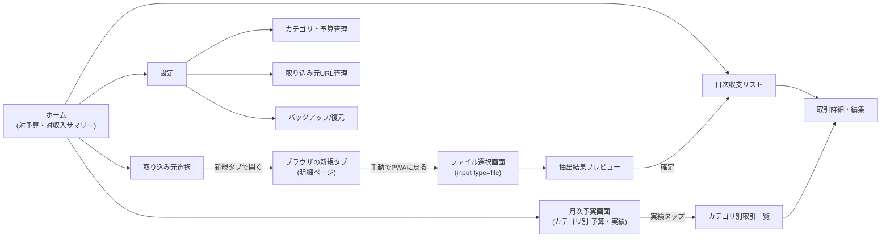

# 詳細設計書 — 個人用家計簿アプリ(PWA版)

version: 0.4(ドラフト)。要件定義書(`requirements.md`)・システム構成書(`architecture.md`)を前提とする。Mac非保有のため、Web技術(Vite + React + TypeScript)によるPWAとして実装する。

## 1. 画面一覧・遷移



| 画面 | 概要 | 実装 |
|---|---|---|
| ホーム | 月選択+当月の支出合計・収入合計・対予算/対収入の割合を表示するトップ画面(要件定義書 4.7) | `HomeView.tsx` |
| 日次収支リスト | 選択月の収支を日付ごとにグルーピングして一覧表示(要件定義書 4.4) | `DailyListView.tsx` |
| 月次予実画面 | カテゴリごとの予算額・実績額・残額/達成率を一覧表示(要件定義書 4.5) | `MonthlyBudgetView.tsx` |
| カテゴリ別取引一覧 | 月次予実画面で実績をタップした際の内訳 | `CategoryDrilldownView.tsx` |
| 取引詳細・編集 | 個別取引のカテゴリ変更・金額修正・削除 | `TransactionDetailView.tsx` |
| 取り込み元選択 | 三菱UFJ(2口座)・楽天カード・PayPayカードから選択 | `ImportSourceSelectView.tsx` |
| ファイル選択画面 | ダウンロード済みファイルを`<input type="file">`で選択 | `ImportFilePickerView.tsx` |
| 抽出結果プレビュー | Claude APIの抽出結果を確認・修正して確定登録 | `ExtractionPreviewView.tsx` |
| カテゴリ・予算管理 | カテゴリの追加・編集・削除、月次予算額の設定(要件定義書 4.6) | `CategoryBudgetManageView.tsx` |
| 設定 | Anthropic APIキー入力、取り込み元URL管理 | `SettingsView.tsx` |
| バックアップ/復元 | 全データのJSONエクスポート/インポート(8章参照) | `BackupView.tsx` |

## 2. データモデル(TypeScript)

```typescript
// 収入・支出の区分(要件定義書 4.2)
export type TransactionType = "income" | "expense";

// 大カテゴリ(自由入力ではなく、あらかじめ定義された一覧から選択する。要件定義書 4.3/4.6)
// 予算(CategoryBudgetSetting)はこの大カテゴリ単位で設定する
export interface MajorCategory {
  id: string;           // UUID
  name: string;          // 例: "食費"
  displayOrder: number;
}

// 小カテゴリ(大カテゴリに紐づく。初期データは8章「初期カテゴリ一覧」参照)
export interface Subcategory {
  id: string;
  majorCategoryID: string;
  name: string;          // 例: "食料品"、"カフェ"
  displayOrder: number;
}

// カテゴリごとの月次予算設定(大カテゴリ単位)
// 変更履歴を保持し、過去月の予実評価には遡って適用しない(要件定義書 4.6)
export interface CategoryBudgetSetting {
  id: string;
  majorCategoryID: string;
  monthlyAmount: number;
  effectiveFrom: string;  // ISO日付文字列。この日付が属する月以降に適用される
}

// 店名 → カテゴリ の学習マッピング(要件定義書 4.9)
export interface MerchantCategoryMapping {
  id: string;
  merchantKey: string;    // 店名(完全一致で判定)
  subcategoryID: string;
  updatedAt: string;      // ISO日時文字列
}

// 取引データ
export interface Transaction {
  id: string;
  date: string;                 // ISO日付文字列
  merchant: string;             // 店名・利用先(収入の場合は振込元等の摘要)
  amount: number;                // 支出は基本プラス。カード返金等の例外時はマイナス。収入は常にプラス
  type: TransactionType;
  subcategoryID: string | null;  // 支出のみ設定対象。未設定は「未分類」(収入では使用しない)
  sourceInstitutionID: string;    // どの取り込み元から来たか(=日次リストの「支払情報」表示に使う)
  memo: string | null;
  importedAt: string;             // ISO日時文字列(重複検知の補助情報)
}

// 取り込み元(金融機関・カード)の設定
export type FundingSourceKind = "bankAccount" | "creditCard";

export interface FundingSource {
  id: string;
  displayName: string;          // 例: "三菱UFJ 普通口座(給与用)"
  kind: FundingSourceKind;
  statementDeepLinkURL: string;   // 明細ページへの直リンク
}
```

**三菱UFJの2口座の扱い**: `FundingSource`を口座単位で2件登録する(例:「三菱UFJ 普通口座A」「三菱UFJ 普通口座B」)。ディープリンクは共通の明細照会画面URLとし、口座選択自体は新規タブ上でユーザーが手動で行う想定(要件定義書7章の未決事項も参照)。

**大カテゴリ・小カテゴリを分けた理由**: 予算管理(4.5/4.6)は大カテゴリ単位で行う一方、取引ごとの分類(4.9のカテゴリ自動判定)はより粒度の細かい小カテゴリで行いたいため、2階層構造にしている。大カテゴリの実績集計は「そのカテゴリに属する全小カテゴリのTransactionを合算」して求める(3.2参照)。

## 3. 予算・実績集計ロジック

### 3.1 対象月に適用される予算額の決定

`CategoryBudgetSetting`は変更のたびに新しいレコードを追加し(既存レコードを上書きしない)、`effectiveFrom`でいつから有効かを表す。対象月の予算額は「その月の月初時点で最も新しく有効だった設定」を採用する。

```typescript
import { startOfMonth } from "./dateUtils";

/**
 * 指定した大カテゴリ・月に適用される予算額を取得する
 * (過去に確定した月の表示は、後から予算を変更しても変わらない)
 */
export function budgetAmount(
  majorCategoryID: string,
  month: Date,
  settings: CategoryBudgetSetting[]
): number | undefined {
  const monthStart = startOfMonth(month);
  const applicable = settings
    .filter((s) => s.majorCategoryID === majorCategoryID && new Date(s.effectiveFrom) <= monthStart)
    .sort((a, b) => new Date(b.effectiveFrom).getTime() - new Date(a.effectiveFrom).getTime());
  return applicable[0]?.monthlyAmount;
}
```

- 予算を編集した場合、新しい`CategoryBudgetSetting`の`effectiveFrom`は「編集した時点が属する月の月初」とする → **編集した当月と将来月には新しい金額が適用され、それより前の月は編集前の金額のまま**になる
- 該当する設定が1件も無いカテゴリ(予算未設定)は「予算額なし」として月次予実画面に表示する(0円として達成率を計算しない)

### 3.2 月次実績額(支出)の集計

大カテゴリの実績は、そのカテゴリに属する全小カテゴリのTransactionを合算して求める。

```typescript
import { isSameMonth } from "./dateUtils";

export function actualAmount(
  majorCategoryID: string,
  month: Date,
  transactions: Transaction[],
  subcategories: Subcategory[]
): number {
  const subcategoryIDs = new Set(
    subcategories.filter((s) => s.majorCategoryID === majorCategoryID).map((s) => s.id)
  );
  return transactions
    .filter((t) => t.type === "expense" && isSameMonth(new Date(t.date), month))
    .filter((t) => t.subcategoryID != null && subcategoryIDs.has(t.subcategoryID))
    .reduce((sum, t) => sum + t.amount, 0);   // カード返金(マイナス値)も合算され、実績額が相殺される
}
```

### 3.3 月次サマリー(対予算・対収入)の計算

```typescript
export interface MonthlySummary {
  totalExpense: number;
  totalIncome: number;
  totalBudget: number;
  budgetUsageRate: number | undefined;   // 支出 ÷ 予算合計
  incomeUsageRate: number | undefined;   // 支出 ÷ 収入合計
  savings: number;                        // 収入 - 支出
}

export function monthlySummary(
  month: Date,
  transactions: Transaction[],
  budgetSettings: CategoryBudgetSetting[],
  majorCategories: MajorCategory[]
): MonthlySummary {
  const monthTx = transactions.filter((t) => isSameMonth(new Date(t.date), month));
  const totalExpense = monthTx.filter((t) => t.type === "expense").reduce((s, t) => s + t.amount, 0);
  const totalIncome = monthTx.filter((t) => t.type === "income").reduce((s, t) => s + t.amount, 0);
  const totalBudget = majorCategories
    .map((c) => budgetAmount(c.id, month, budgetSettings) ?? 0)
    .reduce((s, v) => s + v, 0);

  return {
    totalExpense,
    totalIncome,
    totalBudget,
    budgetUsageRate: totalBudget > 0 ? totalExpense / totalBudget : undefined,
    incomeUsageRate: totalIncome > 0 ? totalExpense / totalIncome : undefined,
    savings: totalIncome - totalExpense,
  };
}
```

## 4. Claude API連携仕様

### 4.1 リクエスト方針

- SDK: 公式`@anthropic-ai/sdk`を使用し、クライアント初期化時に`dangerouslyAllowBrowser: true`を指定してブラウザからの直接呼び出しを許可する(architecture.md 7章参照)
- モデル: `claude-haiku-4-5`(既定)。抽出精度に問題がある場合は`claude-sonnet-5`に切り替え可能な設定項目とする
- PDFはbase64エンコードして`document`コンテンツブロックとして送信。CSVはテキストとしてそのままプロンプトに含める
- 構造化出力(`output_config.format`)でJSON Schemaを指定し、パース失敗を防ぐ
- 支払方法(一括・分割等)は抽出対象としない(要件定義書 4.2)
- 支出については、店名から大カテゴリ・小カテゴリの候補も併せて推定させる(要件定義書 4.9)

### 4.2 抽出スキーマ

```json
{
  "type": "object",
  "properties": {
    "transactions": {
      "type": "array",
      "items": {
        "type": "object",
        "properties": {
          "date": { "type": "string", "format": "date" },
          "merchant": { "type": "string" },
          "amount": { "type": "number" },
          "type": { "type": "string", "enum": ["income", "expense"] },
          "majorCategory": {
            "type": ["string", "null"],
            "enum": ["食費", "日用雑貨", "交通", "エンタメ", "教育", "美容・衣服", "医療・保健", "通信", "水道・光熱", "車", "その他", "交際費", "税金", "大型出費", null]
          },
          "subcategory": { "type": ["string", "null"] }
        },
        "required": ["date", "merchant", "amount", "type", "majorCategory", "subcategory"],
        "additionalProperties": false
      }
    }
  },
  "required": ["transactions"],
  "additionalProperties": false
}
```

- 三菱UFJ銀行の明細(入金・出金を含む)を渡す際は、プロンプトで「入金は`income`、出金は`expense`として分類してください」と明示する。楽天カード・PayPayカードの明細を渡す際は「原則すべて`expense`とし、返金と判断できる行は金額をマイナス値にしてください」と指示する
- `type`が`income`の場合、`majorCategory`/`subcategory`は`null`を返させる(要件定義書 4.5: 予実管理は支出のみが対象)
- `majorCategory`の`enum`は、実装時に**登録済みの`MajorCategory`一覧から動的に生成する**(ハードコードしない)。カテゴリは4.6の機能で後から追加できるため、追加された大カテゴリも次回リクエストから自動的に選択肢へ反映される
- `subcategory`はJSON Schemaでの列挙(enum)は行わず自由文字列とし、プロンプト側で「指定した大カテゴリに属する小カテゴリ一覧から選んでください」と指示する

### 4.3 リクエスト・レスポンス処理

```typescript
import Anthropic from "@anthropic-ai/sdk";

export interface ExtractionResultItem {
  date: string;
  merchant: string;
  amount: number;
  type: TransactionType;
  majorCategory: string | null;
  subcategory: string | null;
}

export interface ExtractionResult {
  transactions: ExtractionResultItem[];
}

export async function extractTransactions(
  apiKey: string,
  file: { data: string; mimeType: "application/pdf" | "text/csv" },
  sourceKind: FundingSourceKind,
  majorCategoryNames: string[]
): Promise<ExtractionResult> {
  const client = new Anthropic({ apiKey, dangerouslyAllowBrowser: true });

  const instruction =
    sourceKind === "bankAccount"
      ? "この銀行口座の入出金明細を解析してください。入金はtype=income、出金はtype=expenseとして分類してください。支出については、店名から大カテゴリ・小カテゴリを推定してください。"
      : "このクレジットカードの利用明細を解析してください。原則すべてtype=expenseとし、返金と判断できる行は金額をマイナス値にしてください。店名から大カテゴリ・小カテゴリを推定してください。";

  const documentBlock =
    file.mimeType === "application/pdf"
      ? { type: "document" as const, source: { type: "base64" as const, media_type: "application/pdf" as const, data: file.data } }
      : { type: "text" as const, text: file.data };

  const response = await client.messages.create({
    model: "claude-haiku-4-5",
    max_tokens: 8000,
    output_config: {
      format: {
        type: "json_schema",
        schema: buildExtractionSchema(majorCategoryNames),
      },
    },
    messages: [
      {
        role: "user",
        content: [documentBlock, { type: "text", text: instruction }],
      },
    ],
  });

  const textBlock = response.content.find((b) => b.type === "text");
  if (!textBlock || textBlock.type !== "text") {
    throw new Error("Claude APIから有効なレスポンスが得られませんでした");
  }
  return JSON.parse(textBlock.text) as ExtractionResult;
}

function buildExtractionSchema(majorCategoryNames: string[]) {
  return {
    type: "object",
    properties: {
      transactions: {
        type: "array",
        items: {
          type: "object",
          properties: {
            date: { type: "string", format: "date" },
            merchant: { type: "string" },
            amount: { type: "number" },
            type: { type: "string", enum: ["income", "expense"] },
            majorCategory: { type: ["string", "null"], enum: [...majorCategoryNames, null] },
            subcategory: { type: ["string", "null"] },
          },
          required: ["date", "merchant", "amount", "type", "majorCategory", "subcategory"],
          additionalProperties: false,
        },
      },
    },
    required: ["transactions"],
    additionalProperties: false,
  };
}
```

### 4.4 カテゴリ自動判定ロジック(学習マッピング優先)

要件定義書 4.9の優先順位(①学習マッピング → ②Claudeの推定 → ③未分類)を実装するロジック。抽出結果1件ごとに、最終的な小カテゴリを決定する。

```typescript
/** 優先順位: ①学習マッピング(店名の完全一致) → ②Claudeによる推定 → ③未分類(null) */
export function resolveCategory(
  merchant: string,
  claudeSuggestedMajor: string | null,
  claudeSuggestedSub: string | null,
  mappings: MerchantCategoryMapping[],
  subcategories: Subcategory[],
  majorCategories: MajorCategory[]
): string | null {
  const learned = mappings.find((m) => m.merchantKey === merchant);
  if (learned) return learned.subcategoryID;

  if (claudeSuggestedMajor && claudeSuggestedSub) {
    const major = majorCategories.find((m) => m.name === claudeSuggestedMajor);
    if (major) {
      const sub = subcategories.find(
        (s) => s.majorCategoryID === major.id && s.name === claudeSuggestedSub
      );
      if (sub) return sub.id;
    }
  }

  return null;
}
```

- プレビュー画面には`resolveCategory`の結果を初期値として表示し、ユーザーはそのまま確定するか手動修正できる
- ユーザーが手動修正した場合、`MerchantCategoryMapping`を`merchantKey`をキーに**upsert**(既存があれば`subcategoryID`と`updatedAt`を更新、無ければ新規作成)する。これにより同一店名の次回以降の取引は学習マッピングが最優先で適用される

## 5. インポートフロー詳細

1. ユーザーが「取り込み元選択」画面で機関を選ぶ
2. 対応する`FundingSource.statementDeepLinkURL`を`window.open(url, "_blank")`で新規タブとして開く
3. ユーザーが手動でログイン・(必要なら「デスクトップサイト表示」に切り替え)・明細画面へ遷移・CSV/PDFをダウンロード
4. ユーザーが手動でPWAのタブ(ホーム画面から開いたウィンドウ)に戻る
5. アプリがファイル選択画面(`<input type="file" accept=".csv,application/pdf">`)を表示し、ダウンロード済みファイルを選択させる
6. 選択されたファイルを`FileReader`で読み込み、Claude APIへ送信
7. 抽出結果をプレビュー画面に表示。既存データとの重複候補(日付+店名+金額の一致)がある場合はハイライト表示。カテゴリ(支出のみ)は`4.4`の`resolveCategory`により自動で初期値が入力された状態で表示され、ユーザーはそのまま確定するか手動修正できる
8. ユーザーが確認・修正のうえ「確定」を押すと、修正の有無に応じて`MerchantCategoryMapping`をupsertしたうえでIndexedDBに保存

**ネイティブ版(`SFSafariViewController`)との違い**: シートが閉じたことをコードから検知する仕組みが無いため、手順4はユーザーの能動的な操作(タブ切り替え)に委ねる。「ダウンロードが終わったらここに戻ってきてください」という案内文を画面に表示することでカバーする。

## 6. エラーハンドリング方針

| ケース | 対応 |
|---|---|
| Claude API通信エラー(ネットワーク不通・タイムアウト) | エラーメッセージを表示し、再試行ボタンを提示 |
| APIキー未設定・無効 | 設定画面への導線を表示 |
| 抽出結果のJSON Schema不一致・パース失敗 | 生のレスポンステキストを表示し、手動確認を促す(サイレントに失敗させない) |
| ファイル形式非対応(CSV/PDF以外) | `<input>`の`accept`属性で絞り込みつつ、選択後にMIMEタイプを再検証する |
| 明細ページのURL失効(サイト側のリニューアル等) | 設定画面からディープリンクURLを手動更新できるようにする |
| IndexedDBの初期化失敗(プライベートブラウジング等) | 画面にエラーメッセージを表示し、通常モードでの利用を促す |

## 7. ローカルストレージ設計(IndexedDB)

- `idb`ライブラリ(Promiseベースの薄いラッパー)を使い、以下のObject Storeを持つデータベースを1つ作成する
  - `transactions` / `fundingSources` / `majorCategories` / `subcategories` / `categoryBudgetSettings` / `merchantCategoryMappings`
- 初回起動時に、要件定義書 8章の初期カテゴリ一覧(14の大カテゴリとその小カテゴリ)を`majorCategories`/`subcategories`にシード投入する
- 重複検知は取り込み時に「日付・店名・金額が完全一致する既存レコード」を検索し、プレビュー画面で警告表示する(あいまい一致は将来検討)
- `categoryBudgetSettings`は上書きせず追加型で保存し、`3.1`のロジックで対象月の予算額を都度算出する(削除もユーザー操作としては提供しない想定 — 誤って過去の履歴を消すと過去月の予実表示が変わってしまうため)
- `merchantCategoryMappings`は`merchantKey`(店名の完全一致)を実質的な一意キーとして扱い、手動修正のたびに同一店名のレコードがあれば更新、無ければ新規作成する(upsert)

## 8. データバックアップ・復元機能(v1スコープに含める)

**ネイティブ版からの重要な変更点**: iOS Safariには、一定期間操作の無いサイトのローカルストレージ(IndexedDB含む)を消去することがあるという既知の制約がある(architecture.md 7章参照)。SwiftDataであれば端末のバックアップ機構に守られていたが、PWAではこのリスクが実質的に高まるため、**エクスポート/インポート機能を将来検討ではなくv1スコープに引き上げる**。

- 設定画面に「バックアップ」機能を設け、全Object Storeの内容を1つのJSONファイルとしてエクスポートできる(`downloadJSON()`でブラウザのダウンロード機能を使う)
- 同画面から、エクスポートしたJSONファイルを選択して全データを復元(インポート)できる
- 定期的なバックアップを促すため、一定期間(例: 2週間)バックアップが行われていない場合はホーム画面に軽い注意表示を出す

```typescript
export interface BackupPayload {
  exportedAt: string;
  transactions: Transaction[];
  fundingSources: FundingSource[];
  majorCategories: MajorCategory[];
  subcategories: Subcategory[];
  categoryBudgetSettings: CategoryBudgetSetting[];
  merchantCategoryMappings: MerchantCategoryMapping[];
}
```

## 9. 将来拡張ポイント(v1スコープ外)

- 学習マッピングのあいまい一致対応(表記ゆれの吸収)
- 複数月・複数ファイルの一括インポート
- グラフ・集計機能の充実(週次表示、予算アラート等)
- カテゴリ削除時に紐づく`CategoryBudgetSetting`・`Transaction.subcategoryID`・`MerchantCategoryMapping`をどう扱うか(現状は未設計)
- iCloud等を使った端末間同期(v1は単一端末での利用を前提とする)
