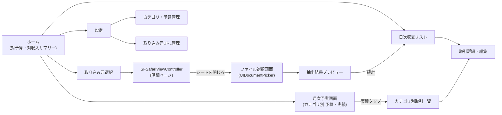

# 詳細設計書 — 個人用家計簿アプリ

version: 0.2(ドラフト)。要件定義書(`requirements.md`)・システム構成書(`architecture.md`)を前提とする。

## 1. 画面一覧・遷移



| 画面 | 概要 |
|---|---|
| ホーム | 月選択+当月の支出合計・収入合計・対予算/対収入の割合を表示するトップ画面(要件定義書 4.7) |
| 日次収支リスト | 選択月の収支を日付ごとにグルーピングして一覧表示(要件定義書 4.4) |
| 月次予実画面 | カテゴリごとの予算額・実績額・残額/達成率を一覧表示(要件定義書 4.5) |
| カテゴリ別取引一覧 | 月次予実画面で実績をタップした際の内訳(日次収支リストをカテゴリで絞り込んだもの) |
| 取引詳細・編集 | 個別取引のカテゴリ変更・金額修正・削除 |
| 取り込み元選択 | 三菱UFJ(2口座)・楽天カード・PayPayカードから選択 |
| SFSafariViewControllerシート | 各機関の明細ページ(手動ログイン・ダウンロード操作) |
| ファイル選択画面 | ダウンロード済みファイルを`UIDocumentPicker`で選択 |
| 抽出結果プレビュー | Claude APIの抽出結果を確認・修正して確定登録 |
| カテゴリ・予算管理 | カテゴリの追加・編集・削除、カテゴリごとの月次予算額の設定(要件定義書 4.6) |
| 設定 | Anthropic APIキー入力(Keychain保存)、取り込み元ディープリンクURLの管理 |

## 2. データモデル

```swift
// 収入・支出の区分
enum TransactionType: String, Codable {
    case income   // 収入(三菱UFJ銀行口座の入金)
    case expense  // 支出(銀行口座の出金・カード利用)。カード返金等の例外時はamountが負の値になる
}

// カテゴリ(自由入力ではなく、あらかじめ定義された一覧から選択する。要件定義書 4.3/4.6)
struct Category: Codable, Identifiable {
    let id: UUID
    var name: String        // 例: "食費"
    var displayOrder: Int
}

// カテゴリごとの月次予算設定
// 変更履歴を保持し、過去月の予実評価には遡って適用しない(要件定義書 4.6)
struct CategoryBudgetSetting: Codable, Identifiable {
    let id: UUID
    var categoryID: Category.ID
    var monthlyAmount: Double
    var effectiveFrom: Date   // この日付が属する月以降に適用される。それより前の月には影響しない
}

// 取引データ
struct Transaction: Codable, Identifiable {
    let id: UUID
    var date: Date
    var merchant: String            // 店名・利用先(収入の場合は振込元等の摘要)
    var amount: Double              // 支出は基本プラス。カード返金等の例外時はマイナス。収入は常にプラス
    var type: TransactionType
    var categoryID: Category.ID?    // 支出のみ設定対象。未設定は「未分類」として扱う(収入では使用しない)
    var sourceInstitutionID: FundingSource.ID  // どの取り込み元から来たか(=日次リストの「支払情報」表示に使う)
    var memo: String?
    var importedAt: Date            // 取り込み日時(重複検知の補助情報)
}

// 取り込み元(金融機関・カード)の設定
struct FundingSource: Codable, Identifiable {
    let id: UUID
    var displayName: String     // 例: "三菱UFJ 普通口座(給与用)"
    var kind: FundingSourceKind
    var statementDeepLinkURL: URL   // 明細ページへの直リンク
}

enum FundingSourceKind: String, Codable {
    case bankAccount   // 三菱UFJの各口座
    case creditCard    // 楽天カード・PayPayカード
}
```

**三菱UFJの2口座の扱い**: `FundingSource` を口座単位で2件登録する(例: 「三菱UFJ 普通口座A」「三菱UFJ 普通口座B」)。ディープリンクは共通の明細照会画面URLとし、口座選択自体はSafari上でユーザーが手動で行う想定(要件定義書7章の未決事項も参照)。

**カテゴリと予算を分離した理由**: `Category`(名称・表示順)と`CategoryBudgetSetting`(金額・適用開始日)を別モデルにしているのは、予算額の変更履歴を保持するため。単純に`Category`に`monthlyAmount`を1つだけ持たせると、変更時に過去月の評価まで書き換わってしまう(要件定義書 4.6で明示的に否定された挙動)。

## 3. 予算・実績集計ロジック

### 3.1 対象月に適用される予算額の決定

`CategoryBudgetSetting`は変更のたびに新しいレコードを追加し(既存レコードを上書きしない)、`effectiveFrom`でいつから有効かを表す。対象月の予算額は「その月の月初時点で最も新しく有効だった設定」を採用する。

```swift
/// 指定したカテゴリ・月に適用される予算額を取得する
/// (過去に確定した月の表示は、後から予算を変更しても変わらない)
func budgetAmount(
    for categoryID: Category.ID,
    month: Date,
    settings: [CategoryBudgetSetting]
) -> Double? {
    let monthStart = startOfMonth(month)
    return settings
        .filter { $0.categoryID == categoryID && $0.effectiveFrom <= monthStart }
        .max(by: { $0.effectiveFrom < $1.effectiveFrom })?
        .monthlyAmount
}
```

- 予算を編集した場合、新しい`CategoryBudgetSetting`の`effectiveFrom`は「編集した時点が属する月の月初」とする → **編集した当月と将来月には新しい金額が適用され、それより前の月は編集前の金額のまま**になる
- 該当する設定が1件も無いカテゴリ(予算未設定)は「予算額なし」として月次予実画面に表示する(0円として達成率を計算しない)

### 3.2 月次実績額(支出)の集計

```swift
func actualAmount(for categoryID: Category.ID, month: Date, transactions: [Transaction]) -> Double {
    transactions
        .filter { $0.type == .expense && $0.categoryID == categoryID && isSameMonth($0.date, month) }
        .reduce(0) { $0 + $1.amount }   // カード返金(マイナス値)も合算され、実績額が相殺される
}
```

### 3.3 月次サマリー(対予算・対収入)の計算

```swift
func monthlySummary(month: Date, transactions: [Transaction], budgetSettings: [CategoryBudgetSetting], categories: [Category]) -> MonthlySummary {
    let monthTx = transactions.filter { isSameMonth($0.date, month) }
    let totalExpense = monthTx.filter { $0.type == .expense }.reduce(0) { $0 + $1.amount }
    let totalIncome = monthTx.filter { $0.type == .income }.reduce(0) { $0 + $1.amount }
    let totalBudget = categories
        .compactMap { budgetAmount(for: $0.id, month: month, settings: budgetSettings) }
        .reduce(0, +)

    return MonthlySummary(
        totalExpense: totalExpense,
        totalIncome: totalIncome,
        totalBudget: totalBudget,
        budgetUsageRate: totalBudget > 0 ? totalExpense / totalBudget : nil,   // 対予算
        incomeUsageRate: totalIncome > 0 ? totalExpense / totalIncome : nil,  // 対収入
        savings: totalIncome - totalExpense
    )
}

struct MonthlySummary {
    let totalExpense: Double
    let totalIncome: Double
    let totalBudget: Double
    let budgetUsageRate: Double?   // 支出 ÷ 予算合計
    let incomeUsageRate: Double?   // 支出 ÷ 収入合計
    let savings: Double            // 収入 - 支出
}
```

## 4. Claude API連携仕様

### 4.1 リクエスト方針

- モデル: `claude-haiku-4-5`(既定)。抽出精度に問題がある場合は `claude-sonnet-5` に切り替え可能な設定項目とする
- PDFはbase64エンコードして `document` コンテンツブロックとして送信。CSVはテキストとしてそのままプロンプトに含める
- 構造化出力(`output_config.format`)でJSON Schemaを指定し、パース失敗を防ぐ
- 支払方法(一括・分割等)は抽出対象としない(要件定義書 4.2)

### 4.2 抽出スキーマ

```json
{
  "type": "object",
  "properties": {
    "transactions": {
      "type": "array",
      "items": {
        "type": "object",
        "properties": {
          "date": { "type": "string", "format": "date" },
          "merchant": { "type": "string" },
          "amount": { "type": "number" },
          "type": { "type": "string", "enum": ["income", "expense"] }
        },
        "required": ["date", "merchant", "amount", "type"],
        "additionalProperties": false
      }
    }
  },
  "required": ["transactions"],
  "additionalProperties": false
}
```

三菱UFJ銀行の明細(入金・出金を含む)を渡す際は、プロンプトで「入金は`income`、出金は`expense`として分類してください」と明示する。楽天カード・PayPayカードの明細を渡す際は「原則すべて`expense`とし、返金と判断できる行は金額をマイナス値にしてください」と指示する。

### 4.3 レスポンス処理

```swift
struct ExtractionResult: Codable {
    struct Item: Codable {
        let date: String
        let merchant: String
        let amount: Double
        let type: TransactionType
    }
    let transactions: [Item]
}

func extractTransactions(fileData: Data, mimeType: String, sourceID: FundingSource.ID) async throws -> [Transaction] {
    // 1. Claude APIへリクエスト(document or text content block + output_config.format)
    // 2. レスポンスをExtractionResultにデコード
    // 3. ExtractionResult.Item を Transaction に変換
    //    (categoryIDはnil、sourceInstitutionID・importedAtを付与。カテゴリはプレビュー画面で人間が選択する)
}
```

## 5. インポートフロー詳細

1. ユーザーが「取り込み元選択」画面で機関を選ぶ
2. 対応する `FundingSource.statementDeepLinkURL` を `SafariView`(`SFSafariViewController`のラッパー、`docs/sfsafariviewcontroller.md`参照)に渡してシート表示
3. ユーザーが手動でログイン・(必要なら「デスクトップサイト表示」に切り替え)・明細画面へ遷移・CSV/PDFをダウンロード
4. ユーザーがシートを閉じる(`SFSafariViewControllerDelegate.safariViewControllerDidFinish`を検知)
5. アプリがファイル選択画面(`UIDocumentPicker`)を表示し、iOSの「ダウンロード」フォルダ等から該当ファイルを選択させる
6. 選択されたファイルを読み込み、Claude APIへ送信
7. 抽出結果をプレビュー画面に表示。既存データとの重複候補(日付+店名+金額の一致)がある場合はハイライト表示。この画面でカテゴリを選択する(支出のみ)
8. ユーザーが確認・修正のうえ「確定」を押すとローカルDBに保存

## 6. エラーハンドリング方針

| ケース | 対応 |
|---|---|
| Claude API通信エラー(ネットワーク不通・タイムアウト) | エラーメッセージを表示し、再試行ボタンを提示 |
| APIキー未設定・無効 | 設定画面への導線を表示 |
| 抽出結果のJSON Schema不一致・パース失敗 | 生のレスポンステキストを表示し、手動確認を促す(サイレントに失敗させない) |
| ファイル形式非対応(CSV/PDF以外) | ファイル選択時点でMIMEタイプを検証し、対応形式のみ選択可能にする |
| 明細ページのURL失効(サイト側のリニューアル等) | 設定画面からディープリンクURLを手動更新できるようにする |

## 7. ローカルストレージ設計(仮: SwiftData)

- `Transaction` / `FundingSource` / `Category` / `CategoryBudgetSetting` をそれぞれ `@Model` クラスとして永続化(SwiftDataは`struct`ではなく`class`+`@Model`を要求するため、上記の`struct`定義は実装時に`@Model class`へ変換する)
- 重複検知は取り込み時に「日付・店名・金額が完全一致する既存レコード」を検索し、プレビュー画面で警告表示する(あいまい一致は将来検討)
- `CategoryBudgetSetting`は上書きせず追加型で保存し、`3.1`のロジックで対象月の予算額を都度算出する(削除もユーザー操作としては提供しない想定 — 誤って過去の履歴を消すと過去月の予実表示が変わってしまうため)
- バックアップ: 初期版ではiCloudバックアップ対象に含めるのみとし、明示的なエクスポート機能は将来検討とする

## 8. 将来拡張ポイント(v1スコープ外)

- Share Extensionによる「ダウンロード→即インポート」の半自動化
- カテゴリの自動分類(ルールベース or Claudeによる推定)
- 複数月・複数ファイルの一括インポート
- グラフ・集計機能の充実(週次表示、予算アラート等)
- データエクスポート(CSV/他アプリ連携)
- カテゴリ削除時に紐づく`CategoryBudgetSetting`・`Transaction.categoryID`をどう扱うか(現状は未設計)
